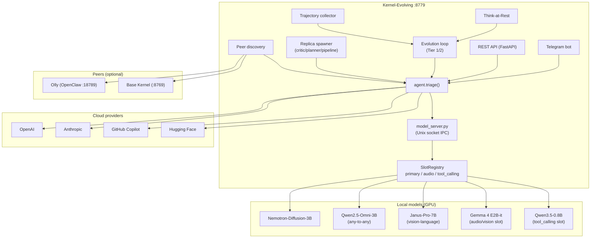

# Kernel-Evolving

> A self-evolving, local-first AI agent with autonomous skill acquisition, Think-at-Rest idle reflection, multi-provider inference, and a Telegram-native control plane.


[](https://firstdonoharm.dev/version/3/0/law-mil-sv.html)

> **v1.0.0 — open-source release.** Machine-specific paths, credentials, and
> internal working notes have been removed and replaced with environment
> variables (see `.env.example`). This is the open-source build of the
> **EVA** agent — see the [OSS repository](https://github.com/neverslave-oss/eva-agent)
> and [eva.neverslave.com](https://eva.neverslave.com).

---

## What It Is

Kernel-Evolving (codenamed **EVA**) is a standalone AI agent that runs entirely on local hardware. It handles fast, frequent tasks using a local GPU model — now including **native any-to-any support** (Qwen2.5-Omni) and **unified vision-language** (Janus-Pro-7B) in addition to the classic Nemotron-Diffusion and Gemma 4 E2B-it — and escalates complex synthesis and planning to cloud providers (OpenAI, Anthropic, GitHub Copilot). It is designed to grow over time — acquiring new skills, refining its behaviour through fine-tuning, and reflecting during idle periods.

**Local primaries (benchmarked):**

| Model | Type | Avg latency | Capabilities |
|---|---|---|---|
| Qwen2.5-Omni-3B | any-to-any | **3.06s** | text, tools, vision, audio |
| Nemotron-Diffusion-3B | diffusion | **3.68s** (cloud) | text, tools |
| Qwen3.5-0.8B | causal LM | **4.29s** | text, tools (direct) |
| Janus-Pro-7B | vision-language | **8.75s** | text, vision |
| Gemma 4 E2B-it | multimodal | 118.4s | text, tools, vision, audio |

**Cloud providers:** Used only for Tier 2 skill synthesis, critic evaluation, planning, and trajectory fine-tuning. Task inference is always local by default.

---

## Core Architecture



Kernel-Evolving manages its own model server process via Unix socket IPC. Evolution state, skill DB, thought journal, and trajectory store are all local. The model server's **SlotRegistry** keeps independently-managed named slots (primary, audio, tool_calling) with LRU eviction, and capable any-to-any / vision-language models (Omni, Janus) drive the full agentic flow natively without a separate tool-calling detour.

**Peer agents:**
- **Olly** (OpenClaw, :18789) — cloud orchestrator, Claude-based. Kernel-Evo is Olly's local execution layer.
- **Base Kernel** (:8769, optional) — production-facing peer. Can delegate skill-gap and evolution tasks here.

---

## Key Modules

| Module | Description |
|---|---|
| `agent.py` | Core triage loop — routes requests, runs context pipeline, calls infer_with_tools |
| `model_server.py` | GPU inference process — SlotRegistry, lazy loading, Unix socket IPC |
| `model_client.py` | Client-side RPC to model_server |
| `provider.py` | Multi-provider routing — local, OpenAI, Anthropic, Copilot, HF per inference role |
| `context.py` | System prompt builder — structured markdown with live data injected per request |
| `skills.py` | Skill loader — ecosytem (community / private / third-party), dedup, context providers |
| `routines.py` | Routine loader and executor |
| `evolver.py` | Tier 1/2 evolution loop — semantic match → verify → synthesise → install |
| `capability_verifier.py` | ADR-006: yes/no verification before Tier 1 resolution |
| `recommender.py` | ADR-007: partial match and composable pair recommendation |
| `code_synthesizer.py` | Tier 2 cloud synthesis of new skills |
| `thought_engine.py` | Think-at-Rest idle reflection — System 1/2 gap detection, identity consolidation |
| `thought_journal.py` | Persistent thought log |
| `micro_planner.py` | ADR-011: multi-step task decomposition before inference |
| `replica.py` | Replica agent spawner — critic, planner, pipeline roles |
| `trajectory_collector.py` | Capture high-quality tool chains for fine-tuning |
| `goal_discovery.py` | Background goal seeding and gap queue management |
| `memory.py` | Multi-chat namespaced conversation memory (SQLite) |
| `embedding_client.py` | Semantic retrieval — top-5 relevant past turns per request |
| `discovery.py` | ADR-015: peer auto-discovery via port scan / mDNS |
| `telegram_bot.py` | Telegram control plane — commands, approval gate, verbose mode |
| `api.py` | FastAPI REST API — all endpoints |
| `evolution_state.py` | Evolution state machine |
| `workspaces.py` | Workspace path resolution |
| `prompt_logger.py` | System prompt registry — logs every built prompt to SQLite for inspection |

---

## Named Model Slots (ADR-018)

The model server supports independently managed named slots, each with its own weights, VRAM footprint, and capability flags. The `primary` slot can be any supported local model — the config-driven default is Nemotron-Diffusion-3B, but you can swap in Qwen2.5-Omni (any-to-any), Janus-Pro-7B (vision-language), Gemma 4 E2B-it, or Qwen3.5-0.8B via the config or `/models/swap`.

| Slot | Default model | Evictable | Purpose |
|---|---|---|---|
| `primary` | Qwen2.5-Omni-3B / Nemotron-Diffusion-3B | Never | All text inference, tool calls, vision, audio |
| `tool_calling` | Qwen3.5-0.8B | Yes (LRU) | Two-stage tool-calling loop (non-native primaries) |
| `audio` | Gemma 4 E2B-it | Yes (LRU) | STT, voice notes, audio-native tasks |
| `draft` | _(future)_ | Yes | Speculative decoding drafter |
| `embed` | _(future)_ | Yes | Embedding generation |

Capable any-to-any / vision-language primaries (Omni, Janus) drive the full agentic flow natively, so the `tool_calling` slot is only used when the primary lacks native tool support. LRU eviction triggers only when free VRAM drops below `vram_threshold_mb` (default 3 GB). On 16 GB VRAM, a 3B primary + Gemma 4 fit simultaneously — eviction is a safety backstop.

---

## Replica System (ADR-008)

Replicas are ephemeral agent instances spawned by the main agent for specific pipeline roles. They use their own system prompt, separate history, and can be routed to a named model slot.

| Role | Purpose |
|---|---|
| `critic` | Evaluates synthesis quality and response correctness |
| `planner` | Generates ordered step plans for complex tasks |
| `pipeline` | Multi-stage: draft → critic → revise |

Active replicas are tracked at `/replica/active`. A replica can declare `slot="audio"` to route inference to the audio slot without touching the primary slot.

---

## Evolution Loop (ADR-004)

```
user task
  ↓
Tier 1: semantic match against installed skills
  ↓ ADR-006 capability verification (yes/no)
  ✅ pass → execute skill
  ❌ fail → ADR-007 recommendation (partial match / composable pair)
              ↓
           Tier 2: cloud synthesis → new skill
              ↓ ADR-010 critic gate (quality check)
              ↓ install → retry task
```

---

## Think-at-Rest (ADR-005)

During idle periods, a speculative decoder generates rapid System 1 gap hypotheses. The full model evaluates each. Confirmed gaps queue for Tier 2 synthesis. Proactive thoughts can be pushed to Telegram.

The think-at-rest cycle also evolves identity and knowledge files:
- **AGENTS.md** — session learnings appended by `_run_identity_consolidator()` (rate-limited: once/20h, min 6 turns)
- **USER.md** — user facts written by `_run_memory_seeker()` as discovered
- **IDENTITY.md** — curated self-description updated during reflection

---

## Context Pipeline (ADR-014)

Three composable layers active on every inference:

1. **Token-aware history** — model-specific budget from `model_context_lengths`. Nemotron gets 2× Gemma's history depth automatically.
2. **Embedding retrieval** — top-5 semantically relevant past turns injected even if outside the linear window.
3. **Skill-driven context providers** — skills with `context_provider: true` in their SKILL.md frontmatter contribute live context at inference time. Collective memory is the primary provider.

The system prompt is built fresh on every inference by `context.py` — structured markdown with live hardware, service status, deduplicated skills/routines, evolution state, and session memory.

---

## Trajectory Fine-Tuning (ADR-013)

Every successful tool-call chain with critic score ≥ 0.7 is saved as a JSONL trajectory. When enough accumulate, a fine-tune job triggers via TRL SFT on HuggingFace Jobs. The resulting LoRA adapter is shadow-tested before replacing the active one.

```
inference → critic score ≥ 0.7 → trajectory saved
  → gate: N new trajectories → trigger TRL job
  → shadow test → swap LoRA adapter
```

---

## Active ADRs

| ADR | Title | Status |
|---|---|---|
| ADR-004 | Two-tier self-evolving loop | ✅ |
| ADR-005 | Think-at-Rest idle reflection | ✅ |
| ADR-006 | Capability verification | ✅ |
| ADR-007 | Capability recommendation | ✅ |
| ADR-008 | Critic replicas + closed-loop feedback | ✅ |
| ADR-009 | Goal discovery boot cap + lazy deferred seeding | ✅ |
| ADR-010 | Evolution pipeline critic gate | ✅ |
| ADR-011 | Micro-planner in triage path | ✅ |
| ADR-012 | Async pipeline execution | ✅ |
| ADR-013 | Multi-provider inference + trajectory fine-tuning | ✅ |
| ADR-014 | Perceptive context pipeline — adaptive history, embedding retrieval, skill providers | ✅ |
| ADR-015 | Agent auto-discovery — peers via port scan / mDNS / MCP | ✅ |
| ADR-016 | Self-evolution completeness — skill ledger, reward signal, trajectory provenance | ✅ |
| ADR-017 | Voice model routing — STT via audio slot vs olly-voice-server | ✅ |
| ADR-018 | Named model slots — SlotRegistry, LRU eviction, replica routing | ✅ |

ADR docs: [`docs/`](docs/)

---

## Install

```bash
git clone https://github.com/neverslave-oss/eva-agent
cd eva-agent
bash install.sh
```

The installer creates `~/.kernel-evolving/` workspace, installs Python deps, and optionally links `.env`. Base kernel is not required.

**Requirements:** Python 3.11+, CUDA GPU (8GB+ VRAM, 16GB recommended), optional OpenAI/Anthropic/Copilot API key for cloud synthesis.

### Global `eva` CLI command

Install the `eva` command globally so you can control EVA from any terminal:

```bash
# After cloning and installing:
ln -sf "$(pwd)/eva" ~/.local/bin/eva
# Ensure ~/.local/bin is on your PATH (add to ~/.bashrc or ~/.zshrc if needed):
export PATH="$HOME/.local/bin:$PATH"
```

Verify:
```bash
eva /status          # system status
eva /skills          # list skills (core multimodal skills first)
eva /routines        # list routines
eva "hello"          # one-shot message
eva                  # interactive chat REPL
```

Fresh install one-liner:
```bash
git clone https://github.com/neverslave-oss/eva-agent && \
  cd eva-agent && \
  bash install.sh && \
  ln -sf "$(pwd)/eva" ~/.local/bin/eva && \
  bash start.sh
```

> **Note:** `eva` talks to the running daemon over HTTP (`http://localhost:8779`). Always start the daemon first with `bash start.sh`. The `EVA_API` env var overrides the base URL for remote access.

---

## Quick Start

```bash
bash start.sh
```

Telegram commands:
```
/evolve                    → evolution menu
/evolve status             → evolution state + thought count
/evolve task <text>        → trigger one evolution cycle
/swap                      → swap active inference model
/verbose                   → stream tool steps live
/update                    → pull latest + restart
/rollback                  → revert to previous version
```

API:
```bash
curl http://localhost:8779/health
curl -X POST http://localhost:8779/message \
  -H 'Content-Type: application/json' \
  -d '{"message": "list installed skills"}'
curl http://localhost:8779/evolution/state
curl http://localhost:8779/evolution/dashboard
```

---

## Configuration

Configuration lives in two places:

- **`config.yaml`** — the primary config (provider routing, model, evolution, thinking, paths).
- **`.env`** — secrets and runtime overrides (API keys, Telegram, provider routing overrides). Copy `.env.example` to `.env` and fill in values; `start.sh` sources it automatically.

### Provider routing: local vs cloud

The `providers.task_inference` key in `config.yaml` (or the `PROVIDER_TASK_INFERENCE` env var) is the master switch that decides whether chat/task inference runs **locally** (Nemotron loaded into VRAM — resource heavy) or on a **cloud provider**:

```yaml
providers:
  task_inference: hf        # local | openai | anthropic | hf | copilot | openrouter
  synthesis: local
  critic: local
  planning: local
  trajectory_teacher: local
```

- `local` → the model server starts and loads the GPU model into VRAM.
- Any cloud value (`openai`, `anthropic`, `hf`, `copilot`, `openrouter`) → the model server is **skipped at startup** (no VRAM used) and the matching cloud provider is called instead. This is the recommended setup on resource-constrained machines.

The model used per role is resolved from `providers.model_overrides.<role>` (falls back to `providers.models.<provider>`). You can hot-swap at runtime via `POST /provider/set` or the `/provider set <role> <provider>` Telegram command.

> ⚠️ **`KERNEL_EVO_FORCE_LOCAL=1`** forces the local model server to start even when `task_inference` is a cloud provider. It is only needed for STT/voice in cloud mode and will load the model into VRAM — **do not set it** if your goal is to reduce resource usage.

### Environment variables

All variables are read from the environment at runtime. The authoritative, commented reference lives in [`.env.example`](.env.example). Summary:

| Variable | Default | Description |
|---|---|---|
| `KERNEL_EVO_TELEGRAM_BOT_TOKEN` | – | Telegram bot token (bot disabled if unset) |
| `KERNEL_EVO_TELEGRAM_CHAT_ID` | – | Allowed Telegram chat id |
| `KERNEL_USER_NAME` / `KERNEL_USER_HANDLE` | – | User identity defaults (Docker, seeds `user.json`) |
| `OPENAI_API_KEY` | – | OpenAI provider key |
| `TMP_OPEN_AI_API_KEY` | – | Alternate/alias OpenAI key |
| `ANTHROPIC_API_KEY` | – | Anthropic provider key |
| `GITHUB_TOKEN` | – | Copilot provider + auto-update |
| `GITHUB_COPILOT_TOKEN` | – | Dedicated Copilot token (falls back to `GITHUB_TOKEN`) |
| `HF_TOKEN` | – | Hugging Face provider + dataset uploads |
| `HF_ROUTER_PROVIDER` | `deepinfra` | HF Router provider (model-id `:provider` suffix) for the `hf` provider |
| `OPENROUTER_API_KEY` | – | OpenRouter provider key |
| `PROVIDER_TASK_INFERENCE` | `local` | Override `providers.task_inference` (see above) |
| `PROVIDER_SYNTHESIS` / `PROVIDER_CRITIC` / `PROVIDER_PLANNING` / `PROVIDER_TRAJECTORY_TEACHER` | per config | Per-role provider routing overrides |
| `KERNEL_EVO_FORCE_LOCAL` | `0` | Force local model server even in cloud mode |
| `MODEL_SOURCE` | `local` | `local` or `docker-hub` |
| `MODEL_ID` | config `model.name` | Model repo to load from HF hub |
| `MODEL_ADAPTER_PATH` | – | Fine-tuned LoRA adapter path |
| `MODEL_SERVER_SOCKET` | `/tmp/kernel_evolving_model.sock` | Model client Unix socket |
| `KERNEL_AUDIO_MODEL_PATH` | config | Audio-slot model path |
| `KERNEL_EMBEDDING_MODEL_PATH` | config | Embedding model path |
| `KERNEL_EVO_DEBUG_TWO_STAGE` | `0` | Print two-stage tool-call traces |
| `MODELS_PATH` | – | Host model cache mount (Docker) |
| `HF_HOME` / `TRANSFORMERS_CACHE` | `~/.cache/huggingface` | HF cache dir |
| `EVOLUTION_ENABLED` | `false` | Master switch for the evolution loop |
| `EVOLUTION_MAX_ITERATIONS` | `10` | Max evolution iterations per cycle |
| `TIER2_APPROVAL_SKIP_LOCAL` | `false` | Skip local approval gate for Tier 2 skills |
| `KERNEL_GH_ALLOWLIST_PREFIX` | `https://github.com/` | Skill repo allowlist prefix |
| `KERNEL_GH_ALLOWLIST_ORG` | `neverslave-oss` | Ecosystem org allowlist |
| `DISCOVERY_INTERVAL_S` | `300` | Goal-discovery scan interval (s) |
| `DISCOVERY_THRESHOLD` | `3` | Hits before a pattern is promoted |
| `DISCOVERY_BOOT_CAP` | `3` | Max patterns seeded at boot |
| `KERNEL_WORKSPACE` | `~/.kernel-evolving/workspace` | Agent workspace root |
| `SKILLS_DIR` / `ROUTINES_DIR` | config | Skills / routines directories |
| `KERNEL_WORKSPACE_PATH` | `~/.kernel-evolving/workspace` | Docker workspace mount |
| `KERNEL_*_DB` (e.g. `KERNEL_MEMORY_DB`) | config | Redirect individual SQLite DB paths |
| `KERNEL_VOICE_ACTIVITY_FILE` | `…/tmp/voice_activity.json` | Voice-activity state file |
| `KERNEL_VOICE_SAMPLES_DIR` | config | Cloned voice samples dir |
| `KERNEL_DEFAULT_VOICE_SAMPLE` | `default-en-phonetic.wav` | Default voice clone sample |
| `VOICE_SERVER_URL` | config | External voice-server URL |
| `VOICE_CHAT_TRIAGE_TIMEOUT_S` | `60` | Voice chat triage timeout |
| `OPENCLAW_ENDPOINT` | `http://localhost:18789` | OpenClaw (Olly) endpoint |
| `OPENCLAW_URL` | – | OpenClaw URL alias (synthesizer) |
| `KERNEL_EVO_GITHUB_REPO` | `neverslave-oss/eva-agent` | Repo used by `/update` |
| `KERNEL_EVO_RELEASES_URL` / `KERNEL_EVO_TAGS_URL` | derived | GitHub API URLs for updates |
| `EVA_API` | `http://localhost:8779` | `eva` CLI API base URL |
| `SIM_MODE` | `false` | Bypass `exec_shell` approval (trajectory collection) |
| `TMPDIR` | `/tmp` | Model server temp dir (forced to `/tmp` if not under it) |

See [`.env.example`](.env.example) for the full annotated reference with per-variable comments.

Key `config.yaml` fields:
```yaml
providers:
  task_inference: hf
  synthesis: local
  critic: local

model:
  name: nvidia/Nemotron-Labs-Diffusion-3B
  quantize: 4bit
  device: auto

model_context_lengths:
  nemotron: 65536
  gemma-4-e2b: 32768
```

---

## REST API

| Method | Path | Description |
|---|---|---|
| `GET` | `/` | Discovery index |
| `GET` | `/health` | Health + VRAM free |
| `GET` | `/peers` | Discovered peers |
| `POST` | `/message` | Send message |
| `GET` | `/provider` | Current provider routing per role |
| `GET` | `/provider/models` | Model catalog per provider |
| `GET` | `/provider/available` | Which providers are ready (API keys set) |
| `POST` | `/provider/set` | Hot-swap provider routing (persist to config.yaml) |
| `POST` | `/config/env` | Set provider/API keys (persist to env-overrides store) |
| `GET` | `/evolution/state` | State, tier counters, gap queue |
| `POST` | `/evolution/control` | Start / stop / pause |
| `POST` | `/evolution/trigger` | Trigger one cycle |
| `GET` | `/evolution/dashboard` | Human-readable dashboard |
| `GET` | `/thoughts` | Think-at-Rest journal |
| `GET` | `/models` | Available models |
| `POST` | `/models/swap` | Swap active model |
| `GET` | `/replica/active` | Active replicas |
| `POST` | `/replica/pipeline` | Multi-stage critic pipeline |
| `GET` | `/skills` | Installed skills |
| `GET` | `/routines` | Installed routines |

### Runtime env overrides (API keys)

Provider API keys and other runtime env vars can be set without editing `.env`:

```bash
curl -X POST http://localhost:8779/config/env \
  -H 'Content-Type: application/json' \
  -d '{"keys": {"HF_TOKEN": "hf_...", "OPENROUTER_API_KEY": "sk-or-..."}}'
```

Values are applied to the running process immediately and persisted to a
dedicated JSON store at `~/.kernel-evolving/workspace/data/env_overrides.json`,
which is loaded into `os.environ` at startup (so they survive restarts and take
precedence over `.env`). Only allowlisted env-var names are accepted; empty
values are ignored (they never clobber an existing key).

---

## Repo

**EVA / Kernel-Evolving (open source):** [neverslave-oss/eva-agent](https://github.com/neverslave-oss/eva-agent)
**Website:** [eva.neverslave.com](https://eva.neverslave.com)

---

## Credits

**EVA / Kernel-Evolving** was created by [**Fabio Pacifici**](https://github.com/fabiopacifici) 🐬 — a self-evolving, local-first AI agent designed to grow, reflect, and improve on its own hardware.

Thanks to the open-source ecosystem (Hugging Face, PyTorch, Transformers, FastAPI) that makes local-first AI possible, and to the contributors who helped shape it.

---

*EVA is released under the [Hippocratic License HL3-LAW-MIL-SV](https://firstdonoharm.dev/version/3/0/law-mil-sv.html).*
