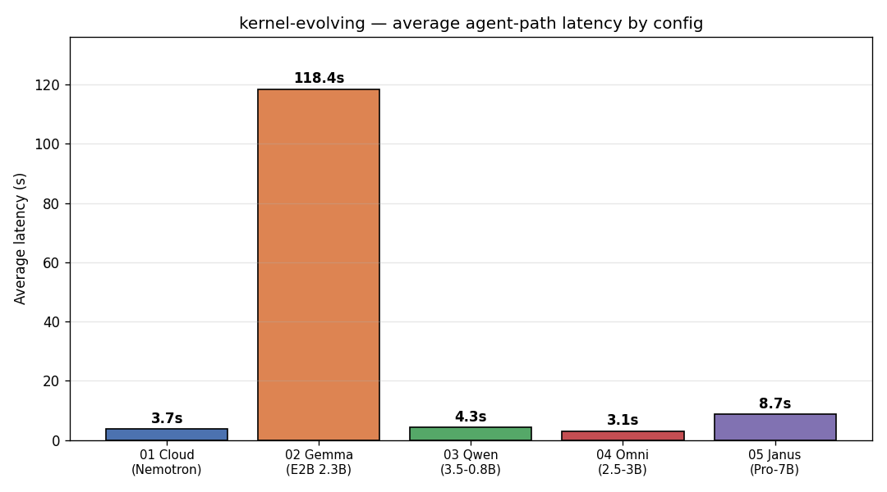
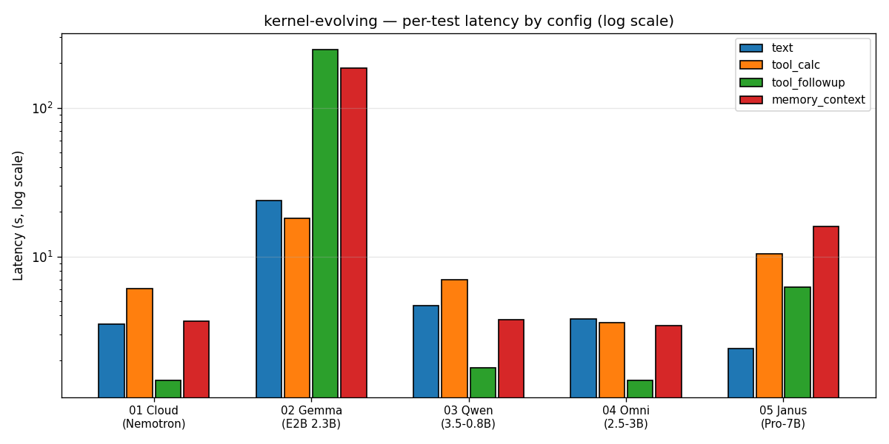

# Local Model Benchmark — kernel-evolving

Benchmark of kernel-evolving behavior through its HTTP API (`POST /message`),
switching configs via `./start.sh --config=configs/<file>` (or by sourcing
`.env` and launching the model server + API directly). Each run sends a battery
of real agent-path messages (text, tool calling, follow-up, memory).

Run: `python3 scripts/benchmark_via_api.py --label <config-label> --models "<desc>"`
Plot: `python3 scripts/plot_benchmarks.py` → `configs/benchmark_avg_latency.png`,
`configs/benchmark_per_test.png`

## Results (2026-08-29)

| Config | Primary model | task_inference | Avg latency | Tool support |
|--------|---------------|----------------|--------------|--------------|
| `01-baseline-cloud` | Nemotron-3B (4bit) + cloud | `hf` (DeepSeek V4 Flash) | **3.68s** | ✅ native (two-stage) |
| `02-local-gemma-primary` | Gemma 4 E2B (4bit) | `local` | **118.42s** | ✅ works, very slow |
| `03-local-qwen-primary` | Qwen3.5-0.8B | `local` | **4.29s** | ⚠️ no native, computes directly |
| `04-local-omni-primary` | Qwen2.5-Omni-3B (4bit) | `local` | **3.06s** | ✅ native (any-to-any) |
| `05-local-janus-primary` | Janus-Pro-7B | `local` | **8.75s** | ⚠️ VLM, no tool loop |

### Per-test latency (s)

| Test | 01-cloud | 02-gemma | 03-qwen | 04-omni | 05-janus |
|------|----------|----------|---------|---------|----------|
| text | 3.51 | 23.80 | 4.65 | 3.78 | 2.40 |
| tool_calc | 6.10 | 17.98 | 6.98 | 3.57 | 10.43 |
| tool_followup | 1.46 | 246.44 | 1.78 | 1.47 | 6.20 |
| memory_context | 3.66 | 185.45 | 3.76 | 3.42 | 15.95 |
| **avg** | **3.68** | **118.42** | **4.29** | **3.06** | **8.75** |

### Multimodal / capability matrix

| Capability | 01-cloud | 02-gemma | 03-qwen | 04-omni | 05-janus |
|------------|----------|----------|---------|---------|----------|
| Text chat | ✅ | ✅ | ✅ | ✅ | ✅ |
| Tool calling | ✅ native | ✅ native | ⚠️ direct | ✅ native | ⚠️ direct |
| Read/write file | ✅ | ✅ | ✅ | ✅ | ✅ |
| Vision | ✅ (cloud) | ✅ (local) | ❌ | ✅ (local) | ✅ (local) |
| Audio/STT | ✅ (cloud) | ✅ (local) | ❌ | ✅ (local) | ❌ |

## Charts

## Insights

1. **Qwen2.5-Omni-3B (04) is the fastest local model — 3.06s avg**, beating even
   the cloud baseline (3.68s). As a native any-to-any model, it drives the
   entire agentic flow itself (no Qwen two-stage detour, no Nemotron synthesis),
   and handles text, tools, vision, and audio all locally. This is the
   recommended local primary.

2. **Cloud baseline (01) remains a strong, clean baseline (3.68s)** — Nemotron
   primary + cloud task_inference with reliable native tool calling.

3. **Local Gemma (02) is 32× slower (118s avg)** — a multi-step tool follow-up
   took 246s. Not usable for interactive chat, though it is capable (tools +
   vision + audio). Best used as a background thought slot, not primary.

4. **Local Qwen3.5 (03) is fast (4.29s)** but reports no native tool-calling —
   it computes directly (manual arithmetic) rather than calling the calculator
   tool. Fast but less agentic.

5. **Janus-Pro-7B (05) is capable but slower (8.75s)** — it's a vision-language
   model with no native tool loop (falls back to direct computation) and no
   audio. It's the strongest pure-VLM for vision understanding (8.2s on the
   describe test) but the heaviest model here (7B), so it uses ~16GB VRAM.

## Recommended configs

- **Default local primary:** `04-local-omni-primary` — fastest, most capable
  (text + tools + vision + audio), native agentic.
- **Cloud mode:** `01-baseline-cloud` — clean baseline, near-fastest, cloud LLM.
- **Vision-heavy local:** `05-local-janus-primary` — best pure vision VLM, but
  no tools/audio and high VRAM.
- **Background thought slot:** `02-local-gemma-primary` — capable but slow;
  use for Think-at-Rest, not interactive chat.

## Next steps

- Validate **think-at-rest** works when inference is cloud: thoughts run locally
  on the most efficient capable local model (Omni for speed + capability).
- Extend the benchmark to cover: a skill invocation, a routine, think-at-rest,
  and a real scaffolding task (landing page).
- Consider pulling a recent **function-calling 7B Qwen** model and benchmarking
  it as a tool-capable local primary.
